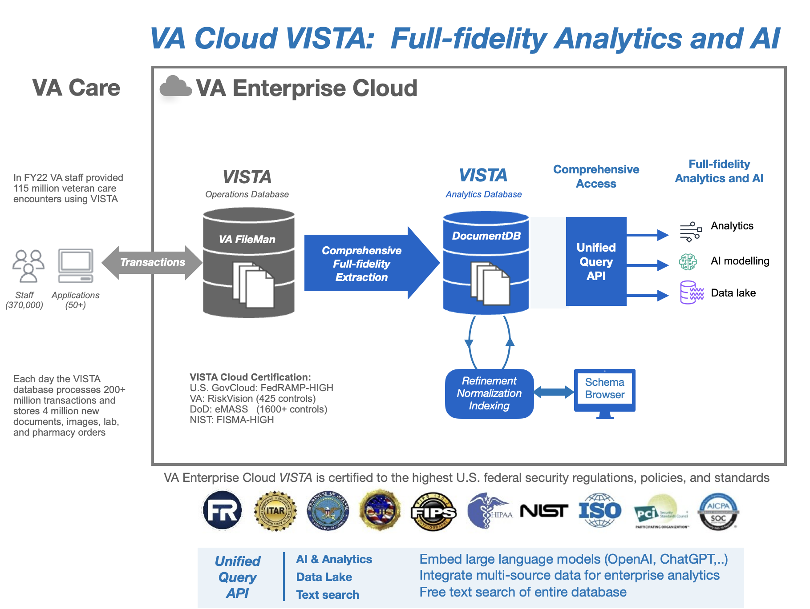

## Comprehensive Full-Fidelity Access of VISTA data in Modern Mainstream Cloud-Native Database to Enable Precision AI and Analytics

### Background

The VHA Information Systems Technology and Architecture (VISTA) is the comprehensive lifelong health record of all veterans, and supports the clinical, business, and financial operations of the VHA. VISTA’s database contains over  300 million veteran-years of data spanning over 35 years and continues to grow at the rate of over four million new lab tests, documents, and images each day. VHA has published over 35,000 peer reviewed medical studies over the past decade based on VISTA data, enabling the VHA to provide the highest quality evidence-based healthcare in the United States.

VISTA’s database is designed and managed as a hierarchical filestore, with its data defined and managed by a file manager (FileMan). FileMan contains over 6,000 files and 75,000 fields with cross-references and pointers connecting all of these files and fields in a well-defined data model.

### Problem statement

There are several mechanisms to extract subsets of FileMan data for secondary use but there is no comprehensive mechanism to export, query, and manage all FileMan data.  Currently, less than 15% of FileMan data is accessible to reporting systems, creating blind spots that may affect the quality of research, trustworthiness of AI models, and accuracy clinical decision support systems (Table 1).

A comprehensive approach is thus needed to provide full-fidelity access to VISTA data for interfacing, integration, and syndication of VISTA data with new cloud-native reporting and research systems to support full-fidelity machine learning, analytics, clinical decision support, and preservation of veteran data in computable form.

### Proposal

Replication of the VISTA’s hierarchical database (FileMan) with full fidelity (lossless, automated, 1:1 mapping of all fields) into a modern, mainstream, cloud-native database of the same form (hierarchical; includes MongoDB and other NoSQL databases)  allows comprehensive continuity of access, management, and query  of all Veteran health data in a modern, mainstream, maintainable, cloud-native database in the VA Enterprise Cloud. (Figure 1). 

A full, detailed report of all VISTA data migrated would be generated from the VISTA MongoDB replica to enable planning and scoping of data management for VA.  The report would contrast the FileMan data of each VISTA with the others.  The mechanisms used to make all the reports will serve as examples for how the MongoDB replica may easily be queried and processed in other projects going forward using the standard MongoDB tools, interfaces, and technology.

Criteria | Fileman Document DB | Commercial Document DB
--- | --- | ---
Contents | All VistA data | All VistA data + refinements
Where | VistA | VAEC 
Support | Proprietary, Internal VA | Commercial/Commonly used
Indexing | Per Patient | Flexible, incremental
Modeled | Schema (DD) | VistA Data Model (FileMan Schema Enhanced)
Access | Limited as Operational Database* | As much as VAEC facilities allow
Governance | VistA Efficiency Focused | Analytics focused, distinction of Clinical, Business and Operational data

* cannot allow outside querying as database must support active clinical and business operations.

### Benefits

MongoDB-based FileMan data provides comprehensive access to all Veteran data directly, securely, with full granularity and data definition of FileMan, but without any of the legacy code or infrastructure to maintain. 

Preserving the FileMan "framing" for data ensures preservation of the semantics of all VISTA data without the requiring a laborious and largely manually created data reframing which could never encompass all the data of a VISTA system in a timely or cost-effective fashion.

### Assumptions

1. FileMan is a Model
Pointers, Dates, Types, Cross References, Hierarchy, and Document Mix
2. One can replicate the FileMan Model with full fidelity in a modern commercial datastore 
FileMan-level replication preserves all definition, structure, pointers, and cross-references
3. A Full-Fidelity FileMan Model Exporter Exists and doesn't need new work. 
This was created under a prior VA project and is available immediately 
4. Exported FileMan-consistent data fits natively into commercial Document Stores 
This includes MongoDB, and Azure- and AWS- managed versions of MongoDB
5. Replication will be in a FedRAMP-HIGH VA Enterprise Cloud Production Environment 
The full-fidelity replica of FileMan will contain PHI/PII
6.  VA has capacity in managing MongoDB databases
VA currently manages a massive MongoDB database farm in the VA Enterprise Cloud

### Technical Note

Only a direct, full-fidelity 1:1 replication of the FileMan hierarchical data model and data within a modern database of the identical form (i.e., hierarchical) will avoid the data loss involved with transforming the data into a different kind of database (relational or otherwise). Such a full-fidelity replication will comprehensively capture, describe and ‘liberate’ all FileMan data in a modern, maintainable, accessible form. VA has developed this automated  FileMan data model migration tool  and this is available to the government at no cost. Expertise in FileMan will nevertheless still be required to execute this replication strategy.

What full-fidelity FileMan-MongoDB replication is not:  
* Not a generic process: No commercial tool or data platform has this capability.
* Not a proprietary process: No vendor-proprietary tools or technology involved.
* Not a  lift-and-shift process: Moving databases to a new datacenter does not fix data accessibility.
* Not an  ETL process (which ignores the FileMan model and replaces with a different one).  

### References

●	VA FileMan Documentation:  https://www.va.gov/vdl/application.asp?appid=5  
●	FileMan model management: http://vistadataproject.info

